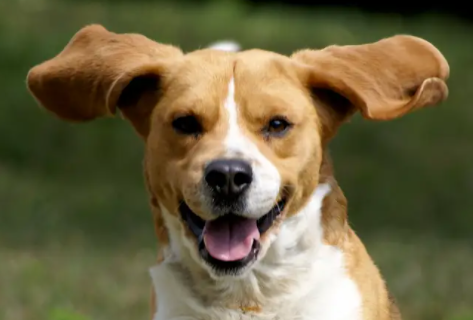

# Chapter 1

  


```python
class GhostModule(nn.Module):
    def __init__(
        self, inp, oup,
        kernel_size=1, ratio=2, dw_size=3, stride=1, relu=True
    ):
        super().__init__()
        self.oup = oup
        init_channels = math.ceil(oup / ratio)
        new_channels = init_channels*(ratio-1)

        self.primary_conv = nn.Sequential(
            nn.Conv2d(i
                np, init_channels, kernel_size,
                stride, kernel_size//2, bias=False
                ),
            nn.BatchNorm2d(init_channels),
            nn.ReLU(inplace=True) if relu else nn.Sequential(),
        )

        self.cheap_operation = nn.Sequential(
            nn.Conv2d(
                init_channels, new_channels, dw_size, 1, dw_size//2, groups=init_channels, bias=False
            ),
            nn.BatchNorm2d(new_channels),
            nn.ReLU(inplace=True) if relu else nn.Sequential(),
        )

    def forward(self, input):
        output_1 = self.primary_conv(input)
        output_2 = self.cheap_operation(output_1)
        output = torch.cat([output_1, output_2], dim=1)
        return output[:, :self.oup, :, :]
```