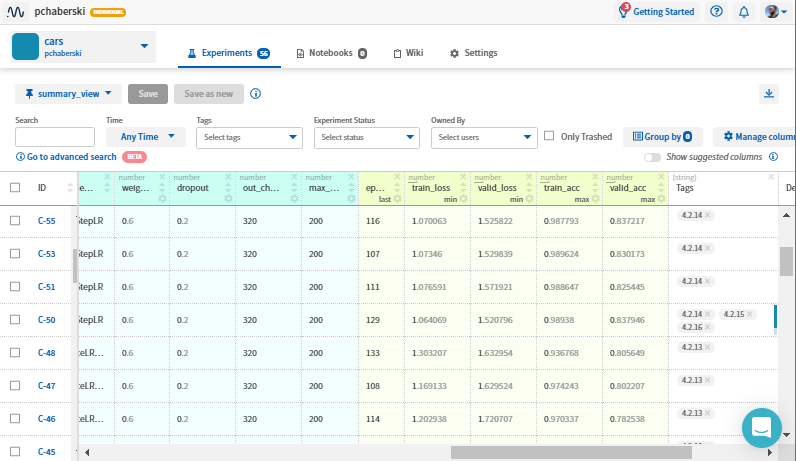
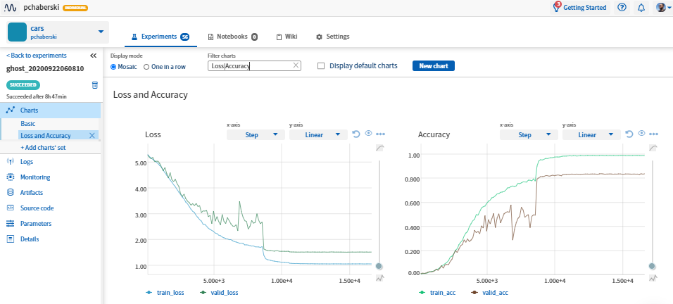
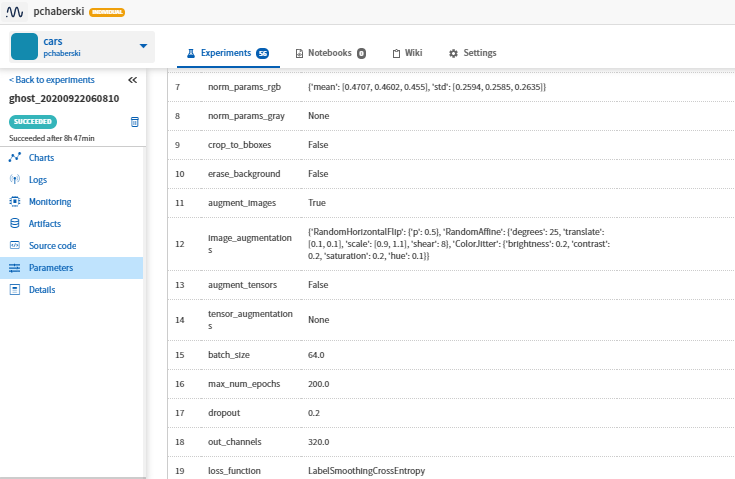
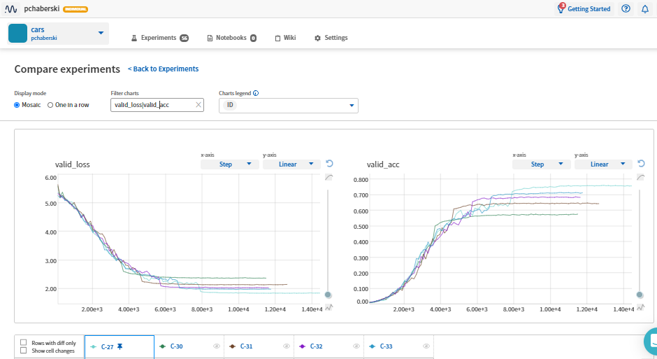

# 3. Experimentation setup

The experimentation setup is entirely based on Python. GhostNet (and some [other networks](https://github.com/pchaberski/cars/tree/documentation/models/architectures), which also can be used) implementation is written in PyTorch. Training process is orchestrated using `pytorch-lightning` package and controlled by parameters passed through YAML config file. Neptune experiment management tool (https://neptune.ai/) was used for experiment tracking. To build an environment for data preparation and model training Python `virtual env` utility was used. In addition to local training setup there is also a possibility to recreate the project environment and run training on Google Colab platform using a prepared Jupyter Notebook.

## 3.1. Project structure <a name="project-structure"></a>

Source code for the project is available in GitHub repository: https://github.com/pchaberski/cars. Repository contains the following elements:

* `documentation` - folder containing markdown files with project documentation, images, bibliography as a `.bib` file and some tools for document conversion
* `datasets` - Python package containing:
    * `stanford_data.py` module implementing class for Stanford Cars data loading and preprocessing
    * `stanford_data_module.py` - module implementing `LightningDataModule` defining data loaders for main training `LightnigModule`
    * `stanford_utils.py` - utility to process raw files downloaded from dataset webpage to be suitable for training and validation
* `models` - Python package containing:  
    * `architectures` - folder with modules implementing `GhostNet` and several other architectures that were briefly tested during initial stage of the project (`SqueezeNet`, `SqueezeNext`, `EfficientNet`, `MobileNet-V2`, `ShuffleNet`, `HarDNet`)
    * `arch_dict.py` - module with a dictionary of architectures that can be used in experiments
    * `net_module.py` - module containing main `LightningModule` used for network training and evaluation
    * `label_smoothing_ce.py` - implementation of Label Smoothing Cross Entropy loss function [[15]](5_references.md#Poulopoulos2020)
* `utils` - Python packages with utilities for configuration parsing, logging and execution time measurement
* `notebooks` - folder containing additional Jupyter notebooks (e.g. for normalization parameters calculation)
* `config_template.yml` - YAML configuration file template; it is supposed to be filled and saved as `config.yml` to allow controlling training settings (mostly data preprocessing settings and model hyperparameters) without interference with source code
* `prod_requirements.txt` - list of external PyPI Python packages to be included in `virtual env` to run the training
* `dev_requirements.txt` - list of additional PyPI Python packages that were used during development and results postprocessing
* `prepare_stanford_dataset.py` - executable Python script that prepares raw files from dataset website to the form suitable for training and validation
* `train.py` - main executable Python script for running experiments
* `train_colab.ipynb` - Jupyter Notebook that can be used to recreate local working environment on Google Colab and run `train.py` remotely

## 3.2. Working environment <a name="working-environment"></a>

Project structure allows to run experiments in two modes, also simultaneously:  

 - locally on a machine with GPU and CUDA drivers
 - remotely on Google Colab

Local setup was tested on Windows laptop (although experimentation environment should be also reproducible on Linux with no changes in the project) with mobile GeForce RTX 2060 and Python 3.7.6. Google Colab setup recreates the environment to mirror all local package versions and runs on Python 3.6.9, however no compatibility issues were observed.

The first step to prepare for running experiments is to **clone the project GitHub repository**. If the training is to be performed on Colab, project folder should be cloned into `Google Drive` folder that is synchronized with remote Google Drive directory. This will allow to to sync all local changes on the fly and run Colab training without the need of pushing all changes made locally to git remote origin each time and then pulling them on Colab drive.

Before running data preprocessing or local training, the Python environment has to be prepared. It is advised to recreate the environment using Python `virtual env` utility and `prod_requirements.txt` file attached to project repository (using Anaconda is also an option). To do so, the following steps has to be performed using `cmd` or emulated `bash` on Windows or native `bash` on Linux:

Using `cmd` on Windows:

```cmd
:: Go to the project directory that was cloned from GitHub
> cd C:\Users\username\Google Drive\cars

:: Create Python virtual env in some other directory 
:: (different than Google Drive to prevent constant syncing of new packages)
> python -m venv C:\projects\venvs\cars

:: Activate newly created virtual env
> C:\projects\venvs\cars\Scripts\activate.bat

:: Install dependencies from prod_requirements.txt file
:: (explicitely pointing to PyTorch repository)
(cars) > pip install -r prod_requirements.txt -f ^
https://download.pytorch.org/whl/torch_stable.html

```

Using `bash` on Linux:

```bash
# Go to the project directory that was cloned from GitHub
$ cd ~/Google Drive/cars

# Create Python virtual env in some other directory 
# (different than Google Drive to prevent constant syncing of new packages)
$ python -m venv ~/venvs/cars

# Activate newly created virtual env
$ ~/venvs/cars/bin/activate

# Install dependencies from prod_requirements.txt file
(cars) $ pip install -r prod_requirements.txt
```

To allow data loaders to process data during training, **raw files have to be preprocessed** using [`prepare_stanford_dataset.py`](https://github.com/pchaberski/cars/blob/documentation/prepare_stanford_dataset.py) script. It takes three files downloaded from Stanford Cars website, assuming they are stored in a directory passed through `stanford_raw_data_path` parameter of the configuration file (please see section [3.3](#configuration) for details):  

- [`car_ims.tgz`](http://imagenet.stanford.edu/internal/car196/car_ims.tgz) - updated collection of train and test images 
- [`cars_annos.mat`](http://imagenet.stanford.edu/internal/car196/cars_annos.mat) - updated train and test labels and bounding boxes
- [`car_devkit.tgz`](https://ai.stanford.edu/~jkrause/cars/car_devkit.tgz) - original devkit containing class names

The script processes the above-mentioned raw files to obtain:  

- `train` and `test` folders with images used for training and validation, separated for the ease of data loaders implementation
- `train_labels.csv` and `test_labels.csv` files with image names and class numbers associated with them, as well as bounding box coordinates and class names. It is important to notice, that in raw data class are numbered within range of 1 to 196, while PyTorch Lightning requires classes to be represented by numbers starting from 0. This issue is handled internally within [`StanfordCarsDataset`](https://github.com/pchaberski/cars/blob/documentation/datasets/stanford_data.py) class and has to be taken into account during interpretation of model predictions.

Preprocessed images and metadata are saved within the directory pointed by `stanford_data_path` configuration parameter (by default, `input/stanford` folder is created within project folder). **If the training is supposed to be run on Colab** it is strongly advisable to prepare also a `.tar.gz` archive (e.g. `stanford.tar.gz`) from `train`, `test`, `train_labels.csv` and `test_labels.csv` and put it on Google Drive. This will allow to quickly copy and unpack the the data from Google Drive to Colab drive before training which will speed up data loading, and therefore training multiple times, as reading image by image from Google Drive takes incomparably more time than reading directly from Colab drive.

After cloning the repository and preparing the data (also creating and filling up `config.yml` from `config_template.yml` as described in [3.3](#configuration)) it is possible to run experiments.

**To run experiment locally**, after setting all parameters in `config.yml`, `virtual_env` has to be activated and [`train.py`](https://github.com/pchaberski/cars/blob/documentation/train.py) has to be run from command line using `python`.

**To run experiment on Colab**, after making sure that project files and data is put on Google Drive, [`train_colab.ipynb`](https://github.com/pchaberski/cars/blob/documentation/train_colab.ipynb) notebook has to be opened. In the first cell there are some additional Colab-specific parameters to be set:  

- `colab_google_drive_mount_point` - where the Google Drive is to be mounted on Colab drive
- `colab_remote_project_wdir ` - working directory for remote project - should point to `cars` project folder
- `local_project_wdir` - can be ommited if running on Colab, however notebook will also work locally if correct local path to `cars` project folder is provided
- `DATA_ON_COLAB` - if `True`, images and labels are copied and unpacked before training from Google Drive to Colab drive, assuming that they are originally stored at `$colab_remote_project_wdir/input/stanford.tar.gz`
- `colab_data_dir` - where to unpack data copied from Google Drive

After setting all above paths, the notebook is designed to:
- check if session is running on Colab runtime
- recreate local environment by installing packages from `prod_requirements.txt` on Colab (after this step, runtime restart might be needed to reload new versions of packages)
- copy and unpack data from to Google Drive to Colab drive if `DATA_ON_COLAB=True`
- run `training.py` script on Colab

If project folder is stored on Google Drive, regardless the runtime used (Colab or local), all outputs and logs are stored in the same place, which allows to run up to three simultaneous experiments (two Colab sessions plus one local session).

## 3.3. Configuration <a name="configuration"></a>

All experiments are controlled using `config.yml` file stored in `cars` project folder. This allows to change all experiment-related parameters without any interference in the source code. Initially, after cloning, the repository default settings are stored in `config_template.yml` file. This file has to be copied and renamed as `config.yml`. Configuration file contains parameters related to:  

- logging - locally and using Neptune experiment tracking tool (see section [3.4](experiment-tracking))
- directories where data and outputs (PyTorch lightning model checkpoints) are stored
- image preprocessing and augmentation settings
- network hyperparameters
- optimizer and loss function settings

Before running the training all directory-related settings has to be provided. As for the data preprocessing and modelling settings, `config_template.yml` already contains all parameter values that were used during training the best model achieved in experiment series.

Full contents of `config_template.yml` are listed below:  

```yaml
# Logging settings:
loglevel: 'INFO'
logging_dir: 'logs'
log_to_neptune: False
neptune_username: '<neptune.ai username>'
neptune_project_name: '<neptune.ai project name>'
neptune_api_token: '<neptune.ai API token>'

# Train/test dataset and devkit location
stanford_raw_data_path: '<path to the folder containing: \
car_ims.tgz, cars_annos.mat, car_devkit.tgz>'
stanford_data_path: 'input/stanford'

# Output settings
output_path: 'output'

# General data preprocessinng settings
image_size: &img_size [227, 227]  # Anchor to use in augmentations if needed
convert_to_grayscale: False
normalize: True  
normalization_params_rgb:  # Applied when 'convert_to_grayscale==False'
  mean: [0.4707, 0.4602, 0.4550]
  std: [0.2594, 0.2585, 0.2635]
normalization_params_grayscale:  # Applied when 'convert_to_grayscale==True'
  mean: [0.4627]
  std: [0.2545]

# Training data augmentation settings
crop_to_bboxes: True  # crop training images using bounding boxes
erase_background: True  # erase background outside bboxes to preserve ratios
                        # (only if 'crop_to_bboxes==True') 
augment_images: True
image_augmentations:  # to be applied consecutively
  RandomHorizontalFlip:  # has to be a valid transformation 
                         # from 'torchvision.transforms'
    p: 0.5  # transformation parameters to be passed as '**dict'
  RandomAffine:
    degrees: 25
    translate: [0.1, 0.1]
    scale: [0.9, 1.1]
    shear: 8
  ColorJitter:
    brightness: 0.2
    contrast: 0.2
    saturation: 0.2
    hue: 0.1
augment_tensors: True
tensor_augmentations:  # to be applied consecutively
  RandomErasing:
    p: 0.5
    scale: [0.02, 0.25]

# Network and training settings
architecture: 'ghost'  # Possible options in 'models.arch_dict'
batch_size: 64
num_epochs: 200

# Architecture modifications (right now GhostNet only!)
dropout: 0.2  # dropout rate before the last Linear layer
output_channels: 320  # output channels to be mapped to the number of classes

# Optimizer settings
optimizer: AdamW  # valid optimizer from 'torch.optim'
optimizer_params:
  lr: 0.001
  weight_decay: 0.6
lr_scheduler: ReduceLROnPlateau  # valid lr_scheduler from 'torch.optim' or None
lr_scheduler_params:  # scheduler parameters to be passed as '**dict'
  factor: 0.1
  patience: 5
  threshold: 0.001
  min_lr: 0.0000001

# Loss function settings
loss_function: LabelSmoothingCrossEntropy  # valid loss function from 'torch.nn'
                                           # or custom LabelSmoothingCrossEntropy
loss_params:  # loss parameters to be passed as '**dict'
```

## 3.4. Experiment tracking <a name="experiment-tracking"></a>  

Experiment tracking is set up using [Neptune](https://neptune.ai/) experiment management tool. The tool has some useful features like:  

- Python API and PyTorch Lightning integration
- Customizable logging of training metrics and model hyperparameters, as well as the storage and versioning of model artifacts
- Customizable plots and experiment comparison dashboards live-updated as the training proceeds
- Easy results sharing via HTTP links

Neptune logging can be easily enabled by passing a set of parameters through project `config.yml` file:

```yaml
log_to_neptune: False
neptune_username: '<neptune.ai username>'
neptune_project_name: '<neptune.ai project name>'
neptune_api_token: '<neptune.ai API token>'
```

Results of performed experiments are available under the following link:

[**[Neptune `cars` project dashboard]**](https://ui.neptune.ai/pchaberski/cars/experiments?viewId=ae19164c-ee09-4209-8798-a424142d2082)

The main dashboard table is configured to summarize all most important information about each experiment:

- Experiment ID
- Experiment state, running time and runtime utilized (`local` or `colab`)
- Architecture name
- Image and batch size
- Number of parameters of the network
- Image preprocessing settings: grayscale conversion, normalization, usage of image or tensor augmentations, usage of bounding boxes
- Loss function used
- Optimizer type and its most important settings (learning rate and weight decay)
- Learning rate scheduler type
- Network hyperparameters: dropout rate in classifier, last layer size
- Number of epochs before early stopping was triggered
- Best (minimum) training and validation loss and best (maximum) training and validation accuracy
- Tags linking the experiment to sections of documentation
- Additional experiment description  

  

After clicking on a particular experiment ID it is possible to check detailed logs and metrics.



In Parameters tab all experiment parameters that are passed through `config.yml` can be checked.

  

It is also possible to check multiple experiments and make a comparison between their metrics.  



