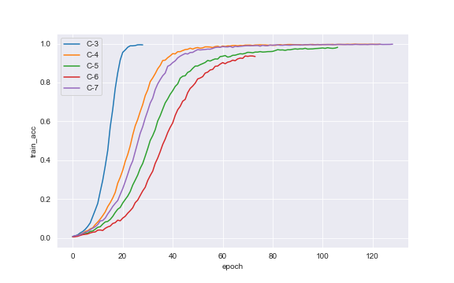
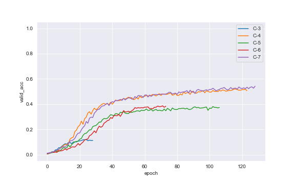
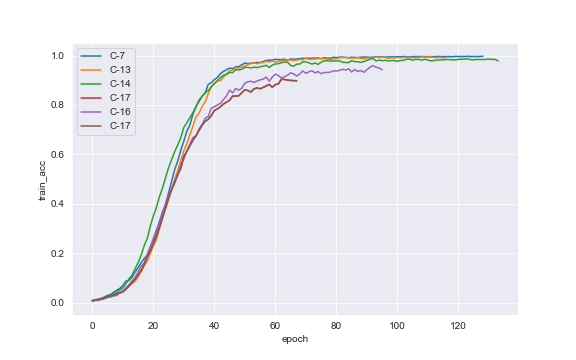
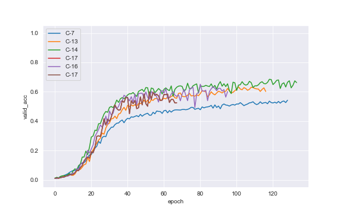
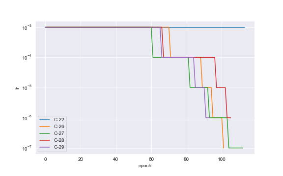
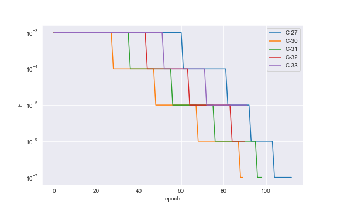
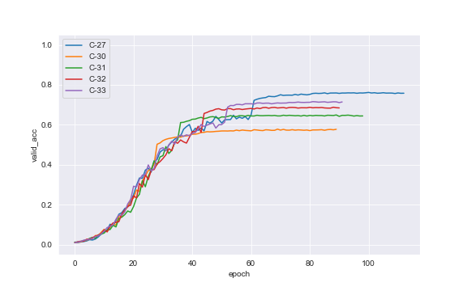

# 4. Results

For the experiments, entire training subset from Stanford Cars Dataset was used for training, and *test* subset was used for validation. There is no additional hold-out testing set so it has to be taken into account that the final accuracy estimate might be somehow biased.

To limit hyperparameter space for best model search, some assumptions were made at the beginning:

- network is trained from scratch, without using any pretrained weights
- input image size is 227x227 (this assumption results from initial tests on SqueezeNext [[6]](5_references.md#Gholami_2018) where this is a minimum image size and all other architectures available in [`arch_dict.py`](https://github.com/pchaberski/cars/blob/documentation/models/arch_dict.py) can handle such image size. For GhostNet, minimum image size is 224x224)
- batch size is fixed at 64 mostly because of local GPU memory limitations, however some tests during development phase showed no gain with smaller or larger batch sizes
- Adam with initial learning rate value of 0.001 is chosen as a default optimizer, and may be changed to AdamW [[16]](5_references.md#loshchilov2017decoupled) when applying weight decay (however SGD was also tested at the development phase, but it was leading to severe overfitting)
- early stopping is triggered when there is no decrease in validation loss for 15 epochs

During experiments, several techniques were used to increase validation accuracy and reduce overfitting, which turned out te be the major issue in training process:

- different loss functions
- pixel value normalization
- various image augmentations
- grayscale conversion
- utilization of bounding boxes
- L2 regularization using weight decay
- dropout rate changing in the classifier module
- last layer size changing
- learning rate scheduling

The search for the best settings was performed in a greedy manner: some arbitrary order of applying different techniques and hyperparameter values was established and after each step the best settings were further augmented using other techniques in order, however a few step-backs and sanity checks were made in the process.

The entire process of obtaining the best model is described step-by-step in section [4.2](#experiments-step-by-step).

## 4.1. Best model <a name="best-model"></a>

[**[Neptune charts]**](https://ui.neptune.ai/pchaberski/cars/e/C-50/charts)

The best model that was obtained during the process achieved 83.79 % top-1 accuracy on the validation set after training for 129 epochs and Label Smoothing Cross Entropy function. Best metrics scores for that model are:  

| Metric                 | Value          |
|------------------------|----------------|
|Min. training loss      |1.064           |
|Min. validation loss    |1.521           |
|Max. training accuracy  |98.93%          |
|Max. validation accuracy|83.79%          |

The best model still shows significant overfitting so there might be some space for further improvement. However, taking into account that the same model achieves 73.98% on ImageNet dataset suggests that the score of 83.79% on the Stanford Cars Dataset is quite decent. While Stanford Cars Dataset contains much less classes (196 in comparison to 1000 in ImageNet), those classes seem harder to distinguish and the dataset itself is much smaller.

It is also important to notice, that due to lesser number of classes, The size of the last layer was reduced during tests - instead of passing 1280-channel input to the classifier, only 320 channels are passed, which results in the total reduction of parameter count from 4.2 million to slightly over 3 millions.

")

")

")

The full set of settings and hyperparameters used to train the best performing model is listed below:

* runtime:
   * `colab`
* architecture:
   * `GhostNet`
* num_params:
   * `3041412.0`
* img_size:
   * `[227, 227]`
* grayscale:
   * `False`
* normalize:
   * `True`
* norm_params_rgb:
   * `{'mean': [0.4707, 0.4602, 0.455], 'std': [0.2594, 0.2585, 0.2635]}`
* norm_params_gray:
   * `None`
* crop_to_bboxes:
   * `False`
* erase_background:
   * `False`
* augment_images:
   * `True`
* image_augmentations:
   * `{'RandomHorizontalFlip': {'p': 0.5}, 'RandomAffine': {'degrees': 25, 'translate': [0.1, 0.1], 'scale': [0.9, 1.1], 'shear': 8}, 'ColorJitter': {'brightness': 0.2, 'contrast': 0.2, 'saturation': 0.2, 'hue': 0.1}}`
* augment_tensors:
   * `False`
* tensor_augmentations:
   * `None`
* batch_size:
   * `64.0`
* max_num_epochs:
   * `200.0`
* dropout:
   * `0.2`
* out_channels:
   * `320.0`
* loss_function:
   * `LabelSmoothingCrossEntropy`
* loss_params:
   * `None`
* optimizer:
   * `AdamW`
* learning_rate:
   * `0.001`
* weight_decay:
   * `0.6`
* all_optimizer_params:
   * `{'lr': 0.001, 'weight_decay': 0.6}`
* lr_scheduler:
   * `MultiStepLR`
* lr_scheduler_params:
   * `{'gamma': 0.1, 'milestones': [67, 82, 95, 107]}`  

## 4.2. Experiments step-by-step <a name="experiments-step-by-step"></a>

The table below presents the summary of model accuracy scores for all experiments along with a brief information of techniques used in training. Full and interactive comparison is available through [Neptune dashboard](https://ui.neptune.ai/pchaberski/cars/experiments?viewId=ae19164c-ee09-4209-8798-a424142d2082). Also, all experiments results (parameters and logged metrics) are archived in a text file [on GitHub](https://github.com/pchaberski/cars/blob/documentation/documentation/results/all_experiments.txt).

|      |experiment description                                       |train_acc|valid_acc|
|------|-------------------------------------------------------------|:-------:|:-------:|
|C-1 |Baseline (Cross Entropy Loss)                                |92.49%   |8.15%    |
|C-2 |Loss function change (Label Smoothing Cross Entropy)         |98.89%   |9.12%    |
|C-3 |Augmentations: horizontal flip, affine                       |99.45%   |11.96%   |
|C-4 |Augmentations: horizontal flip, affine, erasing              |99.76%   |51.92%   |
|C-5 |Augmentations: horizontal flip, erasing, color jitter        |98.12%   |38.08%   |
|C-6 |Augmentations: horiz. flip, affine, erasing, color jitter    |93.68%   |38.68%   |
|C-7 |Augmentations: horizontal flip, affine, color jitter         |99.73%   |54.28%   |
|C-8 |Grayscale: no normalization, no augmentations                |99.49%   |6.58%    |
|C-9 |Grayscale: with normalization, no augmentations              |97.13%   |8.68%    |
|C-10|Grayscale: normalization, best RGB augmentations             |7.58%    |3.91%    |
|C-11|Training set cropping with bounding boxes                    |4.36%    |3.07%    |
|C-12|Training set cropping + background erasing                   |99.67%   |50.51%   |
|C-13|L2 regularization with AdamW: weight decay = 0.1             |99.44%   |63.39%   |
|C-14|L2 regularization with AdamW: weight decay = 0.2             |98.84%   |68.50%   |
|C-15|L2 regularization with AdamW: weight decay = 0.3             |95.83%   |61.84%   |
|C-16|L2 regularization with AdamW: weight decay = 0.4             |95.95%   |65.14%   |
|C-17|L2 regularization with AdamW: weight decay = 0.5             |90.38%   |59.95%   |
|C-18|Dropout rate tests: dropout = 0.1                            |99.11%   |66.90%   |
|C-19|Dropout rate tests: dropout = 0.3                            |98.62%   |67.81%   |
|C-20|Dropout rate tests: dropout = 0.4                            |96.52%   |64.88%   |
|C-21|Dropout rate tests: dropout = 0.5                            |96.28%   |66.75%   |
|C-22|Last layer size tests: out channels = 320                    |97.13%   |68.93%   |
|C-23|Last layer size tests: out channels = 640                    |96.13%   |63.13%   |
|C-24|Last layer size tests: out channels = 960                    |98.23%   |64.96%   |
|C-25|Last layer size tests: out channels = 1600                   |98.99%   |63.11%   |
|C-26|Automatic LR scheduling: take #1                             |99.82%   |74.60%   |
|C-27|Automatic LR scheduling: take #2                             |99.78%   |76.20%   |
|C-28|Automatic LR scheduling: take #3                             |99.83%   |75.14%   |
|C-29|Automatic LR scheduling: take #4                             |99.78%   |74.82%   |
|C-30|Controlled LR scheduling: milestones = [28, 48, 68, 88]      |80.66%   |57.82%   |
|C-31|Controlled LR scheduling: milestones = [36, 56, 76, 96]      |95.03%   |64.93%   |
|C-32|Controlled LR scheduling: milestones = [44, 64, 84, 104]     |98.68%   |68.79%   |
|C-33|Controlled LR scheduling: milestones = [52, 72, 92, 112]     |99.60%   |71.59%   |
|C-36|Weight decay adjustment: weight decay = 0.5                  |98.84%   |79.40%   |
|C-37|Weight decay adjustment: weight decay = 0.3                  |99.57%   |74.44%   |
|C-38|Weight decay adjustment: weight decay = 0.4                  |99.37%   |78.82%   |
|C-39|Weight decay adjustment: weight decay = 0.6                  |98.67%   |82.55%   |
|C-40|Weight decay adjustment: weight decay = 0.7                  |99.24%   |75.12%   |
|C-41|Dropout rate verification: dropout = 0.3                     |98.49%   |82.08%   |
|C-42|Dropout rate verification: dropout = 0.4                     |95.34%   |79.57%   |
|C-43|Dropout rate verification: dropout = 0.5                     |96.08%   |77.87%   |
|C-44|Dropout rate verification: dropout = 0.25                    |98.79%   |82.45%   |
|C-45|Additional augmentations test: resized crop                  |97.56%   |78.73%   |
|C-46|Additional augmentations test: rotation                      |97.03%   |78.25%   |
|C-47|Additional augmentations test: perspective                   |97.42%   |80.22%   |
|C-48|Additional augmentations test: erasing                       |93.68%   |80.56%   |
|**C-50**|**LR scheduler adjustment: milestones = [67, 82, 95, 107]**      |**98.94%**   |**83.79%**   |
|C-51|LR scheduler adjustment: milestones = [63, 78, 91, 103]      |98.86%   |82.54%   |
|C-53|LR scheduler adjustment: milestones = [66, 81, 94, 106]      |98.96%   |83.02%   |
|C-55|LR scheduler adjustment: milestones = [68, 83, 96, 108]      |98.78%   |83.72%   |
|C-56|LR scheduler adjustment: milestones = [64, 79, 92, 104]      |98.99%   |82.79%   |
|C-58|Last layer size sanity check: out channels = 1280            |99.44%   |78.83%   |
|C-63|LR annealing test: LR geometric sequence                     |99.80%   |70.51%   |
|C-64|LR annealing test: exponentiation base = 0.955               |98.49%   |60.70%   |
|C-65|LR annealing test: exponentiation base = 0.975               |99.66%   |73.07%   |
|C-66|LR annealing test: exponentiation base = 0.98                |98.72%   |70.46%   |

### 4.2.1. Loss function <a name="loss-function"></a>

[**[Neptune comparison]**](https://ui.neptune.ai/pchaberski/cars/compare?shortId=%5B%22C-1%22%2C%22C-2%22%5D&viewId=ae19164c-ee09-4209-8798-a424142d2082&legendFields=%5B%22shortId%22%5D&legendFieldTypes=%5B%22native%22%5D)

The first comparison was between standard Cross Entropy loss function and Label Smoothing Cross Entropy. Label smoothing in classification tasks shows some regularization capability [[15]](5_references.md#Poulopoulos2020) resulting from a change in a standard Cross Entropy loss definition.


In the Label Smoothing Cross Entropy definition `ce(i)` denotes standard Cross Entropy loss, `epsilon` stands for a label smoothing coefficient being a small positive number, and `N` is a number of classes. This modification results in forcing the model to predict not exactly `1` for correct class and `0` for other classes, but instead somehow *smoothed* values of `1 - epsilon` for correct class and `epsilon` for others.

The comparison shows that indeed with all other hyperparameters fixed, label smoothing allows to achieve a slightly better validation accuracy with the training loss decreasing slower, however the overfitting effect is still very large and in assumed setup results in triggering early stopping after only 26 epochs. 

| Metric                 | CE Loss (C-1)  | LSCE Loss (C-2) |
|------------------------|:--------------:|:---------------:|
|Min. training loss      |  0.296         | 1.133           |
|Min. validation loss    |  4.849         | 4.873           |
|Max. training accuracy  | 92.49%         | 98.89%          |
|Max. validation accuracy| 8.15%          | 9.12%           |  

 and LSCE Loss (C-2)")

### 4.2.2. Normalization <a name="normalization"></a>

[**[Neptune comparison]**](https://ui.neptune.ai/pchaberski/cars/compare?shortId=%5B%22C-2%22%2C%22C-3%22%5D&viewId=ae19164c-ee09-4209-8798-a424142d2082&legendFields=%5B%22shortId%22%5D&legendFieldTypes=%5B%22native%22%5D)

The next step in the process was adding normalization to the data using mean and standard deviation calculated on the training set (see [`normalization_coeffs.ipynb`](https://github.com/pchaberski/cars/blob/documentation/notebooks/normalization_coeffs.ipynb) notebook). Centering the data gave a 3 percentage points in validation accuracy, however faster convergence resulted in even faster training loss drop.

 and normalized (b) image")  

| Metric                 | No normalization (C-2)  | RGB normalization (C-3) |
|------------------------|:-----------------------:|:-----------------------:|
|Min. training loss      |1.133                    | 1.075                   |
|Min. validation loss    |4.873                    | 4.792                   |
|Max. training accuracy  |98.89%                   | 99.45%                  |
|Max. validation accuracy|9.12%                    | 11.95%                  |  


### 4.2.3. Augmentations <a name="augmentations"></a>

[**[Neptune comparison]**](https://ui.neptune.ai/pchaberski/cars/compare?shortId=%5B%22C-3%22%2C%22C-4%22%2C%22C-5%22%2C%22C-6%22%2C%22C-7%22%5D&viewId=ae19164c-ee09-4209-8798-a424142d2082&legendFields=%5B%22shortId%22%5D&legendFieldTypes=%5B%22native%22%5D)

The first milestone experiment series was achieved thanks to adding training data augmentations to the model from C-3 experiment. The transformations that were tested were:  

- Random horizontal flip
- Random affine transform
- Color jittering
- Random erasing

; Images with: RandomAffine (b), RandomErasing (c), ColorJitter (d)") 

With C-3 experiment as a baseline, four combinations of the above-mentioned transformations were tested:  

- C-4: `RandomHorizontalFlip` + `RandomAffine`
- C-5: `RandomHorizontalFlip` + `RandomAffine` + `RandomErasing`
- C-6: `RandomHorizontalFlip` + `RandomAffine` + `RandomErasing` + `ColorJitter`
- C-7: `RandomHorizontalFlip` + `RandomAffine` + `ColorJitter`

The results showed that the augmentations in general helped to achieve a very large increase in validation accuracy (from 11.96% to 54.28%) while reducing overfitting significantly. As for the particular transformations, it turned out that in the tested setup `RandomErasing` did not help, probably introducing too much variance in the training set combined with other augmentations.

| Metric                 |  C-3   |  C-4  |  C-5  |  C-6  |  C-7  |
|------------------------|:------:|:-----:|:-----:|:-----:|:-----:|
|Min. training loss      |1.075   |0.990  |1.122  |1.315  |1.003  |
|Min. validation loss    |4.792   |2.813  |3.339  |3.452  |2.744  |
|Max. training accuracy  |99.45%  |99.76% |98.12% |93.68% |99.73% |
|Max. validation accuracy|11.95%  |51.92% |38.08% |38.68% |54.28% |






### 4.2.4. Grayscale conversion <a name="grayscale-conversion"></a>

[**[Neptune comparison]**](https://ui.neptune.ai/pchaberski/cars/compare?shortId=%5B%22C-2%22%2C%22C-3%22%2C%22C-8%22%2C%22C-9%22%2C%22C-7%22%2C%22C-12%22%5D&viewId=ae19164c-ee09-4209-8798-a424142d2082&legendFields=%5B%22shortId%22%5D&legendFieldTypes=%5B%22native%22%5D)

Testing how the network will behave after converting input images to grayscale before the training came from the idea, that we want the model to distinguish car models only by the details of design, and obviously not to focus on irrelevant differences such as body color. To adapt the original GhostNet architecture to be able to process also 1-channel images, a small customization was made to the first layer of the network by adding `img_channels` parameters, so that the initial convolution could work on any number of channels in general:  

```python
class GhostNet(nn.Module):
    def __init__(
        self,
        num_classes=1000, img_channels=3, dropout=0.2, out_channels=1280,
        width_mult=1.
    ):
        super().__init__()
        self.num_classes = num_classes
        self.img_channels = img_channels
        self.dropout = dropout
        self.out_channels = out_channels

# ...

        # building first layer
        output_channel = _make_divisible(16 * width_mult, 4)
        layers = [nn.Sequential(
            nn.Conv2d(self.img_channels, output_channel, 3, 2, 1, bias=False),
            nn.BatchNorm2d(output_channel),
            nn.ReLU(inplace=True)
        )]
        input_channel = output_channel

# ...
```

Also some other customizations were made as can be seen above, namely with introducing customizable dropout rate in classifier and last layer size by adding `dropout` and `out_channels` parameters. Those will be discussed in sections [4.2.7](#dropout-rate-tests) and [4.2.8](#last-layer-size-tests), respectively.

Three comparisons were made taking as a baselines identical setups that were previously using 3-channel input:  

- experiment C-8, being a reflection of C-2 (no normalization and no augmentations)
- experiment C-9, being a reflection of C-3 (normalization added, no augmentations)
- experiment C-12, being a reflection of C-7 (normalization + best augmentations)

The results of these tests clearly show, that probably due to the network design, grayscale conversion brings no gain in model performance (in fact, all comparisons are in favor of RGB variants):


|Metric                  |  C-2 (RGB)  |  C-8 (Gr.)  |  C-3 (RGB) |  C-9 (Gr.)  |  C-7 (RGB)  | C-12 (Gr.) |
|------------------------|:------:|:-----:|:-----:|:-----:|:-----:|:-----:|
| Min. training loss       | 1.133  | 1.089  | 1.075  | 1.207  | 1.003  | 1.017  |
| Min. validation loss     | 4.873  | 5.080  | 4.792  | 4.746  | 2.744  | 2.843  |
| Max. training accuracy   | 98.89% | 99.49% | 99.45% | 97.13% | 99.73% | 99.67% |
| Max. validation accuracy | 9.12%  | 6.58%  | 11.96% | 8.68%  | 54.28% | 50.51% |

### 4.2.5. Bounding boxes utilization <a name="bounding-boxes-utilization"></a>

[**[Neptune comparison]**](https://ui.neptune.ai/pchaberski/cars/compare?shortId=%5B%22C-7%22%2C%22C-10%22%2C%22C-11%22%5D&viewId=ae19164c-ee09-4209-8798-a424142d2082&legendFields=%5B%22shortId%22%5D&legendFieldTypes=%5B%22native%22%5D)

Another idea was to try to somehow utilize car bounding boxes coordinates that are available in Stanford Cars Dataset along with the class labels. The goal of the project was however to get possibly unbiased benchmark on original test set (despite it was used for model validation), so any operations using bounding box information could be used only on training subset. Another reason for that is that the ultimate objective is to deploy trained model on a mobile device so it cannot use any information that is unavailable during inference to estimate the performance. Using bounding boxes in performance estimation and eventually during real-life prediction would require to stack the discussed classification model with some kind of detector, which would firstly estimate the location of bounding boxes.

Two approaches of utilizing bounding boxes on training set were consecutively tested, taking so far the best C-7 experiment as a baseline:

- C-10: only cropping images to bounding box coordinates before resize
- C-11: cropping mages to bounding boxes and then putting them on the white background of original image size to preserve ratios before resize

Both transformations were intended to get rid of the image background to try to force the network to focus only on relevant image parts and to prevent it from fitting to background elements.

It turned out that this idea was totally wrong - in the first case (C-10), after crop and resize, all proportions were strongly distorted, which caused large discrepancy between training and validation data and prevented optimizer from converging. The divergence was even stronger in the second case (C-10), because despite preserving original proportions, the network started to focus only on fitting to the white background instead of car details.

| Metric                   | C-7    | C-10  | C-11  |
|--------------------------|:------:|:-----:|:-----:|
| Min. training loss       | 1.003  | 4.570 | 4.822 |
| Min. validation loss     | 2.744  | 5.142 | 5.196 |
| Max. training accuracy   | 99.73% | 7.58% | 4.36% |
| Max. validation accuracy | 54.28% | 3.91% | 3.07% |

### 4.2.6. Optimizer change and L2 regularization <a name="optimizer-change-and-l2-regularization"></a>

[**[Neptune comparison]**](https://ui.neptune.ai/pchaberski/cars/compare?shortId=%5B%22C-7%22%2C%22C-13%22%2C%22C-14%22%2C%22C-15%22%2C%22C-16%22%2C%22C-17%22%5D&viewId=ae19164c-ee09-4209-8798-a424142d2082&legendFields=%5B%22shortId%22%5D&legendFieldTypes=%5B%22native%22%5D)

For the further attempts to reduce overfitting and in consequence increase validation accuracy, one of the most commonly used in parametric machine-learning models techniques was applied - L2 regularization. Optimizers in PyTorch allow for passing `weight_decay` parameter, which represents the strength of penalty added for the too hight model weights. However, as empirical study shows [[16]](5_references.md#loshchilov2017decoupled), this kind of regularization requires decoupling application of weight decay from optimization steps taken with respect to the loss function when using adaptive algorithms like Adam. So to be able to successfully apply this technique in discussed problem, Adam optimized was replaced by its variation utilizing decoupled weight decay - AdamW.

With C-7 as a baseline, 5 different `weight_decay` values were tested with AdamW optimizer:  

- C-13: `weight_dacay = 0.1`
- C-14: `weight_dacay = 0.2`
- C-15: `weight_dacay = 0.3`
- C-16: `weight_dacay = 0.4`
- C-17: `weight_dacay = 0.5`

The results:

| Metric                   | C-7    | C-13   | C-14   | C-15   | C-16   | C-17   |
|--------------------------|:------:|:------:|:------:|:------:|:------:|:------:|
| Min. training loss       | 1.003  | 1.023  | 1.071  | 1.213  | 1.193  | 1.378  |
| Min. validation loss     | 2.744  | 2.315  | 2.089  | 2.285  | 2.174  | 2.301  |
| Max. training accuracy   | 99.73% | 99.44% | 98.84% | 95.83% | 95.95% | 90.38% |
| Max. validation accuracy | 54.28% | 63.39% | 68.50% | 61.84% | 65.14% | 59.95% |

It can be observed that adding larger penalty by increasing `weight_decay` in fact reduces overfitting, but at some point the weights become too constrained preventing the model to fit well to training data and therefore limiting validation accuracy increase. However with all tested values regularized version managed to improve the score without weight decay.





### 4.2.7. Dropout rate tests <a name="dropout-rate-tests"></a>

[**[Neptune comparison]**](https://ui.neptune.ai/pchaberski/cars/compare?shortId=%5B%22C-14%22%2C%22C-18%22%2C%22C-19%22%2C%22C-20%22%2C%22C-21%22%5D&viewId=ae19164c-ee09-4209-8798-a424142d2082&legendFields=%5B%22shortId%22%5D&legendFieldTypes=%5B%22native%22%5D)

Basic GhostNet design has dropout rate before last linear layer fixed at 0.2. As mentioned in [4.2.4](#grayscale-conversion) the original design was customized to allow for passing different dropout values. Some other than default (especially larger, hoping to further reduce overfitting) values were checked.

Dropout rate values that were tested with baseline of 0.2 from C-14 experiment setup were:  

- C-18: `dropout = 0.1`
- C-19: `dropout = 0.3`
- C-20: `dropout = 0.4`
- C-21: `dropout = 0.5`

The above mentioned experiments show no improvement using values different from default.

| Metric                   | C-14   | C-18   | C-19   | C-20   | C-21   |
|--------------------------|:------:|:------:|:------:|:------:|:------:|
| Min. training loss       | 1.071  | 1.039  | 1.087  | 1.173  | 1.191  |
| Min. validation loss     | 2.089  | 2.179  | 2.108  | 2.164  | 2.096  |
| Max. training accuracy   | 98.84% | 99.11% | 98.62% | 96.52% | 96.28% |
| Max. validation accuracy | 68.50% | 66.90% | 67.81% | 64.88% | 66.75% |

### 4.2.8. Last layer size tests <a name="last-layer-size-tests"></a>

[**[Neptune comparison]**](https://ui.neptune.ai/pchaberski/cars/compare?shortId=%5B%22C-14%22%2C%22C-22%22%2C%22C-23%22%2C%22C-24%22%2C%22C-25%22%5D&viewId=ae19164c-ee09-4209-8798-a424142d2082&legendFields=%5B%22shortId%22%5D&legendFieldTypes=%5B%22native%22%5D)

By default in GhostNet architecture the number of channels in the feature vector passed into the classifier module is fixed on value 1280 and those channels are finally mapped on the number of classes by the fully connected layer. As mentioned in [4.2.4](#grayscale-conversion), this value was parametrized based on the assumption, that it could be strictly associated with the specific output number of classes and the architecture was optimized for 1000-class ImageNet, while Stanford Cars Dataset consists of 196 classes.

The values that were tested with respect to 1280 baseline from experiment C-14:

- C-22: `out_channels = 320`
- C-23: `out_channels = 640`
- C-24: `out_channels = 960`
- C-25: `out_channels = 1600`

It is important to notice, that changing the output channels value strongly affects the total parameter count of the network:

|      | output channels | number of parameters |
|------|:---------------:|:--------------------:|
| C-14 | 1280            | 4153090              |
| C-22 | 320             | 3041410              |
| C-23 | 640             | 3411970              |
| C-24 | 960             | 3782530              |
| C-25 | 1600            | 4523650              |

The analysis of results shows no straightforward relationship between the number of output channels and network's performance on the particular dataset that was used, however the lowest number of channels testes (320) turned out to give slightly better validation accuracy that default with less overfitting, while reducing the number of parameters from 4.15 million to 3.04 million.

| Metric                   | C-14   | C-22   | C-23   | C-24   | C-25   |
|--------------------------|:------:|:------:|:------:|:------:|:------:|
| Min. training loss       | 1.071  | 1.140  | 1.196  | 1.108  | 1.071  |
| Min. validation loss     | 2.089  | 2.055  | 2.250  | 2.202  | 2.294  |
| Max. training accuracy   | 98.84% | 97.13% | 96.13% | 98.23% | 98.99% |
| Max. validation accuracy | 68.50% | 68.93% | 63.13% | 64.96% | 63.11% |

### 4.2.9. Automatic learning rate scheduling <a name="automatic-learning-rate-scheduling"></a>

[**[Neptune comparison]**](https://ui.neptune.ai/pchaberski/cars/compare?shortId=%5B%22C-22%22%2C%22C-26%22%2C%22C-27%22%2C%22C-28%22%2C%22C-29%22%5D&viewId=ae19164c-ee09-4209-8798-a424142d2082&legendFields=%5B%22shortId%22%5D&legendFieldTypes=%5B%22native%22%5D)

The more regularization added, the more difficult it is for optimizer to find the optimal solution with a fixed learning rate which is reflected by a more and more jumpy learning curves after certain number of epochs. A natural step in this case is to try to decrease the learning rate after some stagnation starts to show in loss decrease.

The first round of experiments with learning rate schedulers were done using `ReduceLROnPlateau` scheduler from PyTorch, which was set to decrease the learning rate by a factor 0.1 after no decrease in validation loss is observed for 5 consecutive epochs. During the early development phase it was it was observed that randomness in contents of training batches that results in slightly different learning curves even with the same experiment setup each time may also result in triggering learning rate decrease at different epochs, and this in turn may affect the final validation accuracy achieved. To test the scale of this phenomenon, 4 attempts of the same experiment were taken and compared with the results obtained without scheduler (C-22):

- C-26
- C-27
- C-28
- C-29



The results are that the learning rate decrease at the right point of training procedure can give a significant benefit, and the choice of that particular moment based on variability in training data feed is also not without significance.

| Metric                   | C-22   | C-26   | C-27   | C-28   | C-29   |
|--------------------------|:------:|:------:|:------:|:------:|:------:|
| Min. training loss       | 1.140  | 0.995  | 1.014  | 0.988  | 1.006  |
| Min. validation loss     | 2.055  | 1.903  | 1.836  | 1.888  | 1.874  |
| Max. training accuracy   | 97.13% | 99.82% | 99.78% | 99.83% | 99.78% |
| Max. validation accuracy | 68.93% | 74.60% | 76.20% | 75.14% | 74.82% |

")

### 4.2.10. Controlled learning rate scheduling <a name="controlled-learning-rate-scheduling"></a>

[**[Neptune comparison]**](https://ui.neptune.ai/pchaberski/cars/compare?shortId=%5B%22C-27%22%2C%22C-30%22%2C%22C-31%22%2C%22C-32%22%2C%22C-33%22%5D&viewId=ae19164c-ee09-4209-8798-a424142d2082&legendFields=%5B%22shortId%22%5D&legendFieldTypes=%5B%22native%22%5D)

For further investigation of the influence of learning rate drop timing (especially the first drop from 0.001 to 0.0001) on the final validation accuracy, some more experiments with manually set milestones for learning rate decrease were made using `MultiStepLR` scheduler with the same factor of 0.1. Also it was noticed that [4.2.9](#automatic-learning-rate-scheduling) the best results were obtained when the scheduler was triggered the earliest, so milestones were set to push further in this direction:

With the best take from [4.2.9](#automatic-learning-rate-scheduling) (C-27) as the baseline, where automatically triggered milestones were checked to be `[61, 82, 93, 104]`, the experiments were:

- C-30: `milestones = [28, 48, 68, 88]`
- C-31: `milestones = [36, 56, 76, 96]`
- C-32: `milestones = [44, 64, 84, 104]`
- C-33: `milestones = [52, 72, 92, 112]`

Looking at the results and comparing with the baseline it is obvious, that all learning rate drops were triggered too early.

| Metric                   | C-27   | C-30   | C-31   | C-32   | C-33   |
|--------------------------|--------|--------|--------|--------|--------|
| Min. training loss       | 1.014  | 1.749  | 1.321  | 1.142  | 1.059  |
| Min. validation loss     | 1.836  | 2.364  | 2.130  | 2.022  | 1.971  |
| Max. training accuracy   | 99.78% | 80.66% | 95.03% | 98.68% | 99.60% |
| Max. validation accuracy | 76.20% | 57.82% | 64.93% | 68.79% | 71.59% |





### 4.2.11. Weight decay adjustment <a name="weight-decay-adjustment"></a>

### 4.2.12. Dropout rate verification <a name="dropout-rate-verification"></a>

### 4.2.13. Additional augmentations tests <a name="additional-augmentations-tests"></a>

### 4.2.14. Learning rate scheduler adjustment <a name="learning-rate-scheduler-adjustment"></a>

### 4.2.15. Last layer size sanity check <a name="last-layer-size-sanity-check"></a>

### 4.2.16. Learning rate annealing tests <a name="learning-rate-annealing-tests"></a>  

