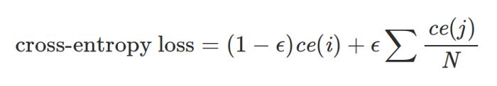
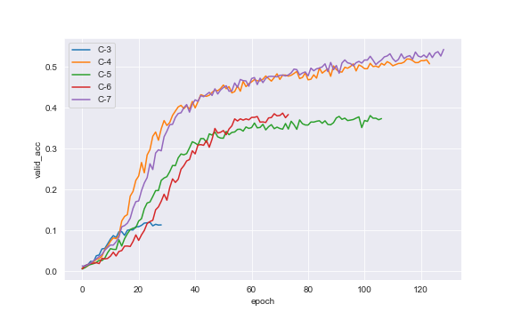

# 4. Results

For the experiments, entire training subset from Stanford Cars Dataset was used for training, and *test* subset was used for validation. There is no additional hold-out testing set so it has to be taken into account that the final accuracy estimate might be somehow biased.

To limit hyperparameter space for best model search, some assumptions were made at the beginning:

- network is trained from scratch, without using any pretrained weights
- input image size is 227x277 (this assumption results from initial tests on SqueezeNext [[6]](5_references.md#Gholami_2018) where this is a minimum image size and all other architectures available in [`arch_dict.py`](https://github.com/pchaberski/cars/blob/documentation/models/arch_dict.py) can handle such image size. For GhostNet, minimum image size is 224x224)
- batch size is fixed at 64 mostly because of local GPU memory limitations, however some tests during development phase showed no gain with smaller or larger batch sizes
- Adam with initial learning rate value of 0.001 is chosen as a default optimizer, and may be changed to AdamW [[16]](5_references.md#loshchilov2017decoupled) when applying weight decay (although SGD was also tested at the development phase, but was leading to severe overfitting)
- early stopping is triggered when there is no decrease in validation loss for 15 epochs

During experiments, several techniques were used to increase validation accuracy and reduce overfitting, which turned out te be the major issue in training process:

- different loss functions
- pixel value normalization
- various image augmentations
- grayscale conversion
- utilization of bounding boxes
- L2 regularization using weight decay
- dropout rate changing in the classifier module
- last layer size changing
- learning rate scheduling

The search for the best settings was performed in a greedy manner: some arbitrary order of applying different techniques and hyperparameter values was established and after each step the best settings were further augmented using other techniques in order, however a few step-backs and sanity checks were made in the process.

The entire process of obtaining the best model is described step-by-step in section [4.2](#experiments-step-by-step).

## 4.1. Best model 

The best model that was obtained during the process achieved 83.79 % top-1 accuracy on the validation set after training for 129 epochs and Label Smoothing Cross Entropy function. Best metrics scores for that model are:  

| Metric                 | Value          |
|------------------------|----------------|
|Min. training loss      |1.064           |
|Min. validation loss    |1.521           |
|Max. training accuracy  |98.93%          |
|Max. validation accuracy|83.79%          |

The best model still shows significant overfitting so there might be some space for further improvement. However, taking into account that the same model achieves 73.98% on ImageNet dataset suggests that the score of 83.79% on the Stanford Cars Dataset is quite decent. While Stanford Cars Dataset contains much less classes (196 in comparison to 1000 in ImageNet), those classes seem harder to distinguish and the dataset itself is much smaller.

It is also important to notice, that due to lesser number of classes, The size of the last layer was reduced during tests - instead of passing 1280-channel input to the classifier, only 320 channels are passed, which results in the total reduction of parameter count from 4.2 million to slightly over 3 millions.

")

")

")

The full set of settings and hyperparameters used to train the best performing model is listed below:

* runtime:
   * `colab`
* architecture:
   * `GhostNet`
* num_params:
   * `3041412.0`
* img_size:
   * `[227, 227]`
* grayscale:
   * `False`
* normalize:
   * `True`
* norm_params_rgb:
   * `{'mean': [0.4707, 0.4602, 0.455], 'std': [0.2594, 0.2585, 0.2635]}`
* norm_params_gray:
   * `None`
* crop_to_bboxes:
   * `False`
* erase_background:
   * `False`
* augment_images:
   * `True`
* image_augmentations:
   * `{'RandomHorizontalFlip': {'p': 0.5}, 'RandomAffine': {'degrees': 25, 'translate': [0.1, 0.1], 'scale': [0.9, 1.1], 'shear': 8}, 'ColorJitter': {'brightness': 0.2, 'contrast': 0.2, 'saturation': 0.2, 'hue': 0.1}}`
* augment_tensors:
   * `False`
* tensor_augmentations:
   * `None`
* batch_size:
   * `64.0`
* max_num_epochs:
   * `200.0`
* dropout:
   * `0.2`
* out_channels:
   * `320.0`
* loss_function:
   * `LabelSmoothingCrossEntropy`
* loss_params:
   * `None`
* optimizer:
   * `AdamW`
* learning_rate:
   * `0.001`
* weight_decay:
   * `0.6`
* all_optimizer_params:
   * `{'lr': 0.001, 'weight_decay': 0.6}`
* lr_scheduler:
   * `MultiStepLR`
* lr_scheduler_params:
   * `{'gamma': 0.1, 'milestones': [67, 82, 95, 107]}`

## 4.2. Experiments step-by-step 

The table below presents the summary of model accuracy scores for all experiments along with a brief information of techniques used in training. Full and interactive comparison is available through [Neptune dashboard](https://ui.neptune.ai/pchaberski/cars/experiments?viewId=ae19164c-ee09-4209-8798-a424142d2082). Also, all experiments results (parameters and logged metrics) are archived in a text file [on GitHub](https://github.com/pchaberski/cars/blob/documentation/documentation/results/all_experiments.txt)

|      |experiment description                                       |train_acc|valid_acc|
|------|-------------------------------------------------------------|:-------:|:-------:|
|C-1 |Baseline (Cross Entropy Loss)                                |92.49%   |8.15%    |
|C-2 |Loss function change (Label Smoothing Cross Entropy)         |98.89%   |9.12%    |
|C-3 |Augmentations: horizontal flip, affine                       |99.45%   |11.96%   |
|C-4 |Augmentations: horizontal flip, affine, erasing              |99.76%   |51.92%   |
|C-5 |Augmentations: horizontal flip, erasing, color jitter        |98.12%   |38.08%   |
|C-6 |Augmentations: horizontal flip, affine, erasing, color jitter|93.68%   |38.68%   |
|C-7 |Augmentations: horizontal flip, affine, color jitter         |99.73%   |54.28%   |
|C-8 |Grayscale: no normalization, no augmentations                |99.49%   |6.58%    |
|C-9 |Grayscale: with normalization, no augmentations              |97.13%   |8.68%    |
|C-10|Grayscale: normalization, best RGB augmentations             |7.58%    |3.91%    |
|C-11|Training set cropping with bounding boxes                    |4.36%    |3.07%    |
|C-12|Training set cropping + background erasing                   |99.67%   |50.51%   |
|C-13|L2 regularization with AdamW: weight decay = 0.1             |99.44%   |63.39%   |
|C-14|L2 regularization with AdamW: weight decay = 0.2             |98.84%   |68.50%   |
|C-15|L2 regularization with AdamW: weight decay = 0.3             |95.83%   |61.84%   |
|C-16|L2 regularization with AdamW: weight decay = 0.4             |95.95%   |65.14%   |
|C-17|L2 regularization with AdamW: weight decay = 0.5             |90.38%   |59.95%   |
|C-18|Dropout rate tests: dropout = 0.1                            |99.11%   |66.90%   |
|C-19|Dropout rate tests: dropout = 0.3                            |98.62%   |67.81%   |
|C-20|Dropout rate tests: dropout = 0.4                            |96.52%   |64.88%   |
|C-21|Dropout rate tests: dropout = 0.5                            |96.28%   |66.75%   |
|C-22|Last layer size tests: out channels = 320                    |97.13%   |68.93%   |
|C-23|Last layer size tests: out channels = 640                    |96.13%   |63.13%   |
|C-24|Last layer size tests: out channels = 960                    |98.23%   |64.96%   |
|C-25|Last layer size tests: out channels = 1600                   |98.99%   |63.11%   |
|C-26|Automatic LR scheduling: take #1                             |99.82%   |74.60%   |
|C-27|Automatic LR scheduling: take #2                             |99.78%   |76.20%   |
|C-28|Automatic LR scheduling: take #3                             |99.83%   |75.14%   |
|C-29|Automatic LR scheduling: take #4                             |99.78%   |74.82%   |
|C-30|Controlled LR scheduling: milestones = [28, 48, 68, 88]      |80.66%   |57.82%   |
|C-31|Controlled LR scheduling: milestones = [36, 56, 76, 96]      |95.03%   |64.93%   |
|C-32|Controlled LR scheduling: milestones = [44, 64, 84, 104]     |98.68%   |68.79%   |
|C-33|Controlled LR scheduling: milestones = [52, 72, 92, 112]     |99.60%   |71.59%   |
|C-36|Weight decay adjustment: weight decay = 0.5                  |98.84%   |79.40%   |
|C-37|Weight decay adjustment: weight decay = 0.3                  |99.57%   |74.44%   |
|C-38|Weight decay adjustment: weight decay = 0.4                  |99.37%   |78.82%   |
|C-39|Weight decay adjustment: weight decay = 0.6                  |98.67%   |82.55%   |
|C-40|Weight decay adjustment: weight decay = 0.7                  |99.24%   |75.12%   |
|C-41|Dropout rate verification: dropout = 0.3                     |98.49%   |82.08%   |
|C-42|Dropout rate verification: dropout = 0.4                     |95.34%   |79.57%   |
|C-43|Dropout rate verification: dropout = 0.5                     |96.08%   |77.87%   |
|C-44|Dropout rate verification: dropout = 0.25                    |98.79%   |82.45%   |
|C-45|Additional augmentations test: resized crop                  |97.56%   |78.73%   |
|C-46|Additional augmentations test: rotation                      |97.03%   |78.25%   |
|C-47|Additional augmentations test: perspective                   |97.42%   |80.22%   |
|C-48|Additional augmentations test: erasing                       |93.68%   |80.56%   |
|**C-50**|**LR scheduler adjustment: milestones = [67, 82, 95, 107]**      |**98.94%**   |**83.79%**   |
|C-51|LR scheduler adjustment: milestones = [63, 78, 91, 103]      |98.86%   |82.54%   |
|C-53|LR scheduler adjustment: milestones = [66, 81, 94, 106]      |98.96%   |83.02%   |
|C-55|LR scheduler adjustment: milestones = [68, 83, 96, 108]      |98.78%   |83.72%   |
|C-56|LR scheduler adjustment: milestones = [64, 79, 92, 104]      |98.99%   |82.79%   |
|C-58|Last layer size sanity check: out channels = 1280            |99.44%   |78.83%   |
|C-63|LR annealing test: LR geometric sequence                     |99.80%   |70.51%   |
|C-64|LR annealing test: exponentiation base = 0.955               |98.49%   |60.70%   |
|C-65|LR annealing test: exponentiation base = 0.975               |99.66%   |73.07%   |
|C-66|LR annealing test: exponentiation base = 0.98                |98.72%   |70.46%   |

### 4.2.1. Loss function 

The first comparison was between standard Cross Entropy loss function and Label Smoothing Cross Entropy. Label smoothing in classification tasks shows some regularization capability [[15]](5_references.md#Poulopoulos2020) resulting from a change in a standard Cross Entropy loss definition.

In the Label Smoothing Cross Entropy definition `ce(i)` denotes standard Cross Entropy loss, `epsilon` stands for a label smoothing coefficient being a small positive number, and `N` is a number of classes. This modification results in forcing the model to predict not exactly `1` for correct class and `0` for other classes, but instead somehow *smoothed* values of `1 - epsilon` for correct class and `epsilon` for others.

The comparison shows that indeed with all other hyperparameters fixed, label smoothing allows to achieve a slightly better validation accuracy with the training loss decreasing slower, however the overfitting effect is still very large and in assumed setup results in triggering early stopping after only 26 epochs. 

| Metric                 | CE Loss (C-1)  | LSCE Loss (C-2) |
|------------------------|:--------------:|:---------------:|
|Min. training loss      |  0.296         | 1.133           |
|Min. validation loss    |  4.849         | 4.873           |
|Max. training accuracy  | 92.49%         | 98.89%          |
|Max. validation accuracy| 8.15%          | 9.12%           |

 and LSCE Loss (C-2)")

### 4.2.2. Normalization 

The next step in the process was adding normalization to the data using mean and standard deviation calculated on the training set (see [`normalization_coeffs.ipynb`](https://github.com/pchaberski/cars/blob/documentation/notebooks/normalization_coeffs.ipynb) notebook). Centering the data gave a 3 percentage points in validation accuracy, however faster convergence resulted in even faster training loss drop.

 and normalized (b) image")

| Metric                 | No normalization (C-2)  | RGB normalization (C-3) |
|------------------------|:-----------------------:|:-----------------------:|
|Min. training loss      |1.133                    | 1.075                   |
|Min. validation loss    |4.873                    | 4.792                   |
|Max. training accuracy  |98.89%                   | 99.45%                  |
|Max. validation accuracy|9.12%                    | 11.95%                  |

### 4.2.3. Augmentations 

The first milestone experiment series was achieved thanks to adding training data augmentations to the model from C-3 experiment. The transformations that were tested were:

- Random horizontal flip
- Random affine transform
- Color jittering
- Random erasing

; Images with: RandomAffine (b), RandomErasing (c), ColorJitter (d)") 

With C-3 experiment as a baseline, four combinations of the above-mentioned transformations were tested:

- C-4: `RandomHorizontalFlip` + `RandomAffine`
- C-5: `RandomHorizontalFlip` + `RandomAffine` + `RandomErasing`
- C-6: `RandomHorizontalFlip` + `RandomAffine` + `RandomErasing` + `ColorJitter`
- C-7: `RandomHorizontalFlip` + `RandomAffine` + `ColorJitter`

The results showed that the augmentations in general helped to achieve a very large increase in validation accuracy (from 11.96% to 54.28%) and while reducing overfitting significantly. As for the particular transformations, it turned out that in the tested setup `RandomErasing` did not help, probably introducing too much variance in the training set combined with other augmentations.

| Metric                 |  C-3   |  C-4  |  C-5  |  C-6  |  C-7  |
|------------------------|:------:|:-----:|:-----:|:-----:|:-----:|
|Min. training loss      |1.075   |0.990  |1.122  |1.315  |1.003  |
|Min. validation loss    |4.792   |2.813  |3.339  |3.452  |2.744  |
|Max. training accuracy  |99.45%  |99.76% |98.12% |93.68% |99.73% |
|Max. validation accuracy|11.95%  |51.92% |38.08% |38.68% |54.28% |

### 4.2.4. Grayscale conversion 

### 4.2.5. Bounding boxes utilization 

### 4.2.6. Optimizer change and L2 regularization 

### 4.2.7. Dropout rate tests 

### 4.2.8. Last layer size tests 

### 4.2.9. Automatic learning rate scheduling 

### 4.2.10. Controlled learning rate scheduling 

### 4.2.11. Weight decay adjustment 

### 4.2.12. Dropout rate verification 

### 4.2.13. Additional augmentations tests 

### 4.2.14. Learning rate scheduler adjustment 

### 4.2.15. Last layer size sanity check 

### 4.2.16. Learning rate annealing tests   

