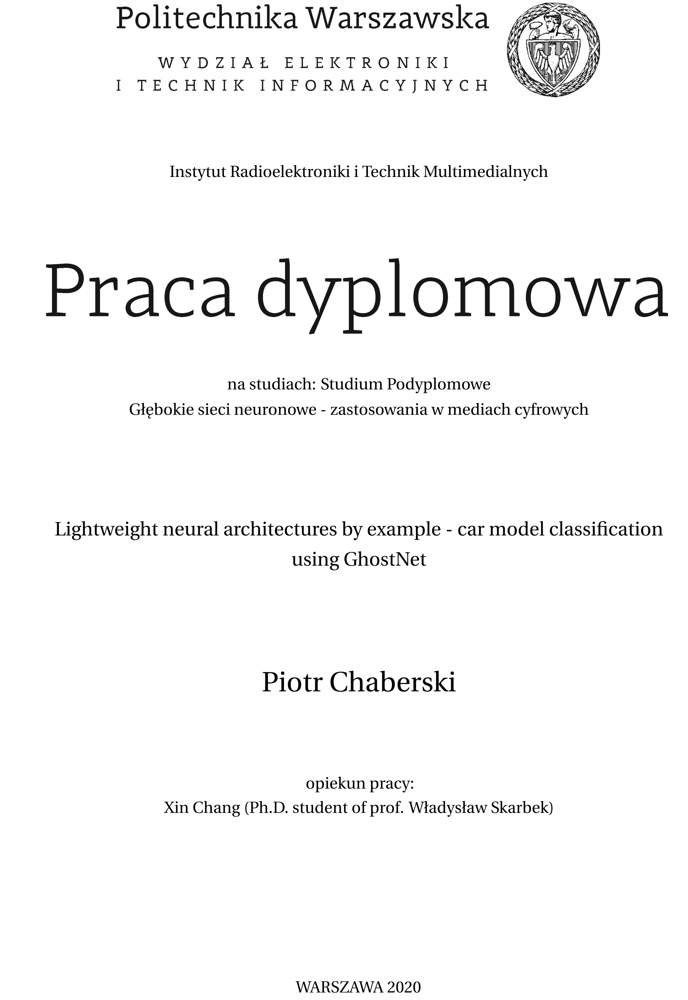

  
 

# Lightweight neural architectures by example - car model classification using GhostNet

**Abstract.** One of the branches of ongoing research in the field of computer vision and neural networks in general is to develop relatively simple architectures that have limited number of trainable parameters and FLOPS required to process data while still being able to achieve competitive accuracy in common tasks. This need for fast and memory-efficient designs is dictated mostly by the necessity of deploying such models on devices with limited computational power and memory, such as smartphones. This work attempts to explore the process of training and finetuning such networks from scratch, taking as an example one of the newest designs in the field (GhostNet developed by Huawei Noah's Ark Lab) and applying it to the Stanford Cars Dataset for car model recognition task.

**Keywords**: deep learning, neural networks, image recognition, mobile architectures, GhostNet, Stanford Cars Dataset

  

# Sieci neuronowe o zredukowanej liczbie parametrów na przykładzie architektury GhostNet zastosowanej w zadaniu klasyfikacji modeli samochodów

**Streszczenie.** Jednym z aktualnych kierunków badań w obszarze sieci neuronowych i wizji komputerowej jest opracowanie możliwie prostych architektur sieci, posiadających jak najmniejszą liczbę parametrów oraz wymagających jak najmniejszej liczby operacji zmiennoprzecinkowych (FLOPS) do przetworzenia danych wejściowych, zachowujących przy tym wysoką jakość predykcji. Główną przyczyną starań dążących do zmniejszenia rozmiarów sieci jest potrzeba wdrażania ich na urządzeniach mobilnych o ograniczonej mocy obliczeniowej i pamięci, takich jak smartfony. Niniejsza praca podejmuje temat uczenia i optymalizacji hiperparametrów tego typu sieci, biorąc za przykład jedną z najnowszysch architektur (sieć GhostNet stworzoną przez zespół badawczo-rozwojowy firmy Huawei) zastosowaną w zadaniu rozpoznawania modeli samochodów z wykorzystaniem zbioru danych Stanford Cars.

**Słowa kluczowe**: głębokie uczenie maszynowe, sieci neuronowe, rozpoznawanie obrazów, architektury mobilne, GhostNet, zbiór Stanford Cars

 
