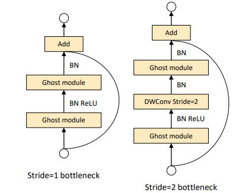

<!-- Slides converted with vscode-reveal in VSCode -->

### Lightweight neural architectures by example - car model classification using GhostNet

Piotr Chaberski

---

<div align="left">

### Broader concept

<font size="6">

1. Training different mobile architectures on an open car dataset and performance comparison in terms of:

    - accuracy
    - model size
    - inference efficiency

2. Preparing custom dataset and finetuning the best model to reflect real distribution

3. Creating a mobile application that will recognize car model in a picture taken by the user

</div>
</font>

---

<div align="left">

### This work's focus

<font size="6">

Applying different training techniques on GhostNet architecture to get the best accuracy on Stanford Cars Dataset.

</div>
</font>


---

<div align="left">

### Stanford Cars Dataset

<font size="6">

- 16,185 images

- 50/50 stratified train/test split

- 196 classes (make, model, production year)

- bounding boxes

- differenet image sizes

- RGB (with some grayscale exceptions)

</div>
</font>

---

<div align="left">

### GhostNet

<font size="6">

**Main assumption**: successful neural network designs use a lot of convolutional filters to create feature maps of which many are similar to each other. Let's try to obtain those redundant feature maps in a more cost-efficient way.

</div>
</font>


---

<div align="left">

### GhostNet - GhostModule

<font size="6">

GhostModule splits standard many-filter convolution into two parts, which are concatenated at the end:

1. also standard convolution, but with less filters to create a set of base feature maps
2. some cheap linear operations, that create redundant feature maps from base feature maps

</div>
</font>


---

<div align="left">

### GhostModule in PyTorch

<font size="5">

```python
class GhostModule(nn.Module):
    def __init__(
        self, inp, oup,
        kernel_size=1, ratio=2, dw_size=3, stride=1,
        relu=True
    ):
        super().__init__()
        self.oup = oup
        init_channels = math.ceil(oup / ratio)
        new_channels = init_channels*(ratio-1)

        self.primary_conv = nn.Sequential(
            nn.Conv2d(
                inp, init_channels, kernel_size, stride,
                kernel_size//2, bias=False
            ),
            nn.BatchNorm2d(init_channels),
            nn.ReLU(inplace=True) if relu else nn.Sequential(),
        )

        self.cheap_operation = nn.Sequential(
            nn.Conv2d(init_channels, new_channels, dw_size, 1,
            dw_size//2, groups=init_channels, bias=False
        ),
            nn.BatchNorm2d(new_channels),
            nn.ReLU(inplace=True) if relu else nn.Sequential(),
        )
    def forward(self, input):
        output_1 = self.primary_conv(input)
        output_2 = self.cheap_operation(output_1)
        output = torch.cat([output_1, output_2], dim=1)
        return output[:, :self.oup, :, :]
```

</div>
</font>

---

<div align="left">

### GhostBottleneck

<font size="5">

Two GhostModules = GhostBottleneck

</div>
</font>



---

<div align="left">

##### GhostNet setup

<font size="3">

|   Input               |   Operator          |   #exp   |   #out   |   SE   |   Stride   |
|-----------------------|---------------------|----------|----------|--------|------------|
|224 x 224 x 3          |     Conv2d 3x3      |     -    |   16     |   -    |     2      |
|112 x 112 x 16         |       G-bneck       |     16   |   16     |   -    |     1      |
|112 x 112 x 16         |       G-bneck       |     48   |   24     |   -    |     2      |
|56 x 56 x 24           |       G-bneck       |     72   |   24     |   -    |     1      |
|56 x 56 x 24           |       G-bneck       |     72   |   40     |   1    |     2      |
|28 x 28 x 40           |       G-bneck       |     120  |   40     |   1    |     1      |
|28 x 28 x 40           |       G-bneck       |     240  |   80     |   -    |     2      |
|14 x 14 x 80           |       G-bneck       |     200  |   80     |   -    |     1      |
|14 x 14 x 80           |       G-bneck       |     184  |   80     |   -    |     1      |
|14 x 14 x 80           |       G-bneck       |     184  |   80     |   -    |     1      |
|14 x 14 x 80           |       G-bneck       |     480  |   112    |   1    |     1      |
|14 x 14 x 112          |       G-bneck       |     672  |   112    |   1    |     1      |
|14 x 14 x 112          |       G-bneck       |     672  |   160    |   1    |     2      |
|7 x 7 x 160            |       G-bneck       |     960  |   160    |   -    |     1      |
|7 x 7 x 160            |       G-bneck       |     960  |   160    |   1    |     1      |
|7 x 7 x 160            |       G-bneck       |     960  |   160    |   -    |     1      |
|7 x 7 x 160            |       G-bneck       |     960  |   160    |   1    |     1      |
|7 x 7 x 160            |       Conv2d 1x1    |     -    |   960    |   -    |     1      |
|7 x 7 x 960            |       AvgPool 7x7   |     -    |   -      |   -    |     -      |
|1 x 1 x 960            |       Conv2d 1x1    |     -    |   1280   |   -    |     1      |
|1 x 1 x 1280           |       FC            |     -    |   1000   |   -    |     -      |

</div>
</font>

---

<div align="left">

### GhostNet on ImageNet

<font size="6">

- 73.98 % top-1 accuracy
- 4.1 M parameters
- 0.142 GFLOPS for processing 224x224 RGB 

</div>
</font>


---

<div align="left">

### Experimentation setup

<font size="6">

- **environment**: Python 3 + virtutal env or Colab
- **framework**: PyTorch
- **training**: `pytorch-lightning==0.9`
- **configuration**: external YAML file
- **logs and tracking**: [Neptune.ai](https://ui.neptune.ai/pchaberski/cars/experiments?viewId=ae19164c-ee09-4209-8798-a424142d2082)
- **runtime**: either local Windows/Linux with GPU and CUDA or remote Google Colab (also simultaneous sessions)
- **code storage**: [GitHub](https://github.com/pchaberski/cars)

</div>
</font>

---

<div align="left">

### Training assumptions

<font size="6">

- training and validation subsets (no test)

- no pre-training
- image size: 227x227 (RGB or grayscale)
- batch size: 64
- Adam or AdamW when using weight decay
- early stopping after 15 epochs if no decrease in validation loss

</div>
</font>

---

<div align="left">

### Techniques for training

<font size="6">

- different loss functions

- pixel value normalization
- various image augmentations
- grayscale conversion
- utilization of bounding boxes
- L2 regularization using weight decay
- dropout rate changing in the classifier module
- last layer size changing
- learning rate scheduling

</div>
</font>

---

<div align="left">

###### Experiments results summary (1/2)

<font size="2">

|      |experiment description                                       |train_acc|valid_acc|
|------|-------------------------------------------------------------|:-------:|:-------:|
|C-1 |Baseline (Cross Entropy Loss)                                |92.49%   |8.15%    |
|C-2 |Loss function change (Label Smoothing Cross Entropy)         |98.89%   |9.12%    |
|C-3 |Added RGB normalization                                      |99.45%   |11.96%   |
|C-4 |Augmentations: horizontal flip, affine, erasing              |99.76%   |51.92%   |
|C-5 |Augmentations: horizontal flip, erasing, color jitter        |98.12%   |38.08%   |
|C-6 |Augmentations: horiz. flip, affine, erasing, color jitter    |93.68%   |38.68%   |
|C-7 |Augmentations: horizontal flip, affine, color jitter         |99.73%   |54.28%   |
|C-8 |Grayscale: with normalization, no augmentations              |99.49%   |6.58%    |
|C-9 |Grayscale: with normalization, no augmentations              |97.13%   |8.68%    |
|C-10|Training set cropping with bounding boxes                    |7.58%    |3.91%    |
|C-11|Training set cropping + background erasing                   |4.36%    |3.07%    |
|C-12|Grayscale: normalization, best RGB augmentations             |99.67%   |50.51%   |
|C-13|L2 regularization with AdamW: weight decay = 0.1             |99.44%   |63.39%   |
|C-14|L2 regularization with AdamW: weight decay = 0.2             |98.84%   |68.50%   |
|C-15|L2 regularization with AdamW: weight decay = 0.3             |95.83%   |61.84%   |
|C-16|L2 regularization with AdamW: weight decay = 0.4             |95.95%   |65.14%   |
|C-17|L2 regularization with AdamW: weight decay = 0.5             |90.38%   |59.95%   |
|C-18|Dropout rate tests: dropout = 0.1                            |99.11%   |66.90%   |
|C-19|Dropout rate tests: dropout = 0.3                            |98.62%   |67.81%   |
|C-20|Dropout rate tests: dropout = 0.4                            |96.52%   |64.88%   |
|C-21|Dropout rate tests: dropout = 0.5                            |96.28%   |66.75%   |
|C-22|Last layer size tests: out channels = 320                    |97.13%   |68.93%   |
|C-23|Last layer size tests: out channels = 640                    |96.13%   |63.13%   |
|C-24|Last layer size tests: out channels = 960                    |98.23%   |64.96%   |
|C-25|Last layer size tests: out channels = 1600                   |98.99%   |63.11%   |
|C-26|Automatic LR scheduling: take #1                             |99.82%   |74.60%   |
|C-27|Automatic LR scheduling: take #2                             |99.78%   |76.20%   |
|C-28|Automatic LR scheduling: take #3                             |99.83%   |75.14%   |

</div>
</font>

---

<div align="left">

###### Experiments results summary (2/2)

<font size="2">

|      |experiment description                                       |train_acc|valid_acc|
|------|-------------------------------------------------------------|:-------:|:-------:|
|C-29|Automatic LR scheduling: take #4                             |99.78%   |74.82%   |
|C-30|Controlled LR scheduling: milestones = [28, 48, 68, 88]      |80.66%   |57.82%   |
|C-31|Controlled LR scheduling: milestones = [36, 56, 76, 96]      |95.03%   |64.93%   |
|C-32|Controlled LR scheduling: milestones = [44, 64, 84, 104]     |98.68%   |68.79%   |
|C-33|Controlled LR scheduling: milestones = [52, 72, 92, 112]     |99.60%   |71.59%   |
|C-36|Weight decay adjustment: weight decay = 0.5                  |98.84%   |79.40%   |
|C-37|Weight decay adjustment: weight decay = 0.3                  |99.57%   |74.44%   |
|C-38|Weight decay adjustment: weight decay = 0.4                  |99.37%   |78.82%   |
|C-39|Weight decay adjustment: weight decay = 0.6                  |98.67%   |82.55%   |
|C-40|Weight decay adjustment: weight decay = 0.7                  |99.24%   |75.12%   |
|C-41|Dropout rate verification: dropout = 0.3                     |98.49%   |82.08%   |
|C-42|Dropout rate verification: dropout = 0.4                     |95.34%   |79.57%   |
|C-43|Dropout rate verification: dropout = 0.5                     |96.08%   |77.87%   |
|C-44|Dropout rate verification: dropout = 0.25                    |98.79%   |82.45%   |
|C-45|Additional augmentations test: resized crop                  |97.56%   |78.73%   |
|C-46|Additional augmentations test: rotation                      |97.03%   |78.25%   |
|C-47|Additional augmentations test: perspective                   |97.42%   |80.22%   |
|C-48|Additional augmentations test: erasing                       |93.68%   |80.56%   |
|**C-50**|**LR scheduler adjustment: milestones = [67, 82, 95, 107]**      |**98.94%**   |**83.79%**   |
|C-51|LR scheduler adjustment: milestones = [63, 78, 91, 103]      |98.86%   |82.54%   |
|C-53|LR scheduler adjustment: milestones = [66, 81, 94, 106]      |98.96%   |83.02%   |
|C-55|LR scheduler adjustment: milestones = [68, 83, 96, 108]      |98.78%   |83.72%   |
|C-56|LR scheduler adjustment: milestones = [64, 79, 92, 104]      |98.99%   |82.79%   |
|C-58|Last layer size sanity check: out channels = 1280            |99.44%   |78.83%   |
|C-63|LR annealing test: LR geometric sequence                     |99.80%   |70.51%   |
|C-64|LR annealing test: exponentiation base = 0.955               |98.49%   |60.70%   |
|C-65|LR annealing test: exponentiation base = 0.975               |99.66%   |73.07%   |
|C-66|LR annealing test: exponentiation base = 0.98                |98.72%   |70.46%   |


</div>
</font>

---

<div align="left">

###### Best Model settings

<font size="2">

| Parameter                | Value                                                                                                                                                                                                                 |
|--------------------------|-----------------------------------------------------------------------------------------------------------------------------------------------------------------------------------------------------------------------|
| **runtime**              | `colab`                                                                                                                                                                                                               |
| **architecture**         | `GhostNet`                                                                                                                                                                                                            |
| **num_params**           | `3041412`                                                                                                                                                                                                             |
| **img_size**             | `[227, 227]`                                                                                                                                                                                                          |
| **grayscale**            | `0`                                                                                                                                                                                                                   |
| **normalize**            | `1`                                                                                                                                                                                                                   |
| **norm_params_rgb**      | `{'mean': [0.4707, 0.4602, 0.455], 'std': [0.2594, 0.2585, 0.2635]}`                                                                                                                                                  |
| **norm_params_gray**     | `None`                                                                                                                                                                                                                |
| **crop_to_bboxes**       | `0`                                                                                                                                                                                                                   |
| **erase_background**     | `0`                                                                                                                                                                                                                   |
| **augment_images**       | `1`                                                                                                                                                                                                                   |
| **image_augmentations**  | `{'RandomHorizontalFlip': {'p': 0.5}, 'RandomAffine': {'degrees': 25, 'translate': [0.1, 0.1], 'scale': [0.9, 1.1], 'shear': 8}, 'ColorJitter': {'brightness': 0.2, 'contrast': 0.2, 'saturation': 0.2, 'hue': 0.1}}` |
| **augment_tensors**      | `0`                                                                                                                                                                                                                   |
| **tensor_augmentations** | `None`                                                                                                                                                                                                                |
| **batch_size**           | `64`                                                                                                                                                                                                                  |
| **max_num_epochs**       | `200`                                                                                                                                                                                                                 |
| **dropout**              | `0.2`                                                                                                                                                                                                                 |
| **out_channels**         | `320`                                                                                                                                                                                                                 |
| **loss_function**        | `LabelSmoothingCrossEntropy`                                                                                                                                                                                          |
| **loss_params**          | `None`                                                                                                                                                                                                                |
| **optimizer**            | `AdamW`                                                                                                                                                                                                               |
| **learning_rate**        | `0.001`                                                                                                                                                                                                               |
| **weight_decay**         | `0.6`                                                                                                                                                                                                                 |
| **all_optimizer_params** | `{'lr': 0.001, 'weight_decay': 0.6}`                                                                                                                                                                                  |
| **lr_scheduler**         | `MultiStepLR`                                                                                                                                                                                                         |
| **lr_scheduler_params**  | `{'gamma': 0.1, 'milestones': [67, 82, 95, 107]}`                                                                                                                                                                     |

</div>
</font>

---

<div align="left">

### Best model results

<font size="6">

| Metric                 | Value          |
|------------------------|:--------------:|
|Min. training loss      |1.064           |
|Min. validation loss    |1.521           |
|Max. training accuracy  |98.93%          |
|Max. validation accuracy|83.79%          |

</div>
</font>

---

<div align="left">

### Best model - learning rate

</div>


---

<div align="left">

### Best model - loss (LSCE)

</div>


---

<div align="left">

### Best model - top-1 accuracy

</div>


---

## Thank You!

[github.com/pchaberski/cars](https://github.com/pchaberski/cars)